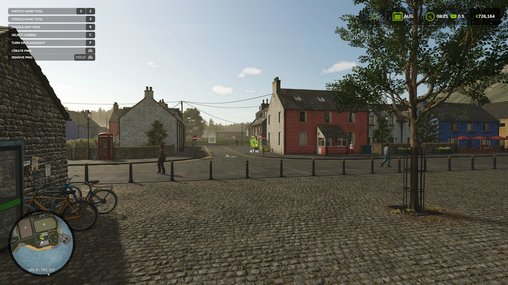
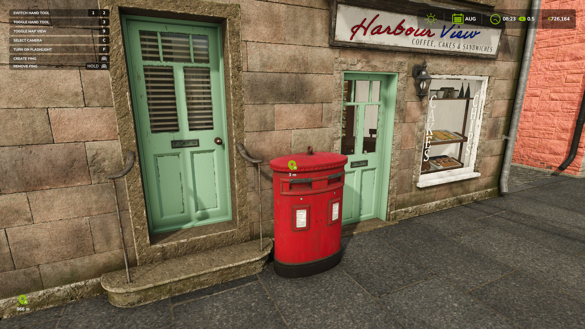
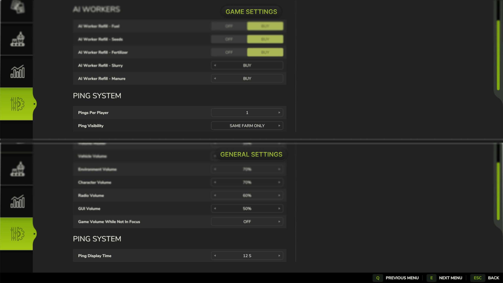

   
  <b>Ping System</b> helps you point out what matters &mdash;
   
  mark fields, buildings, vehicles or any other location with pings visible in the world, on the minimap and on the full-screen map.
   
   

## Features

- **World & Map Markers:** Locate pings with a world marker, distance indicator, off-screen arrow and icons on both maps.
- **Multiplayer Visibility:** Let the host choose whether pings are shared with the same farm or all farms. Pings synchronize for joining players.
- **Customizable Display:** Set a local display time of 5&ndash;30 seconds or use Continuous mode. Approaching a ping temporarily hides its world marker.
- **Per-Player Limits:** Let the host set a savegame limit of 1&ndash;3 active pings per player &mdash; creating a new ping at the limit replaces the oldest one.
- **Singleplayer Support:** Use the ping system in singleplayer with your own local visibility settings.

**Note:** Display time is local &mdash; the same ping may disappear for one player but remain visible to another using Continuous mode.

## Installation

1. Download the latest version of the mod from the [Releases](https://github.com/modnext/pingSystem/releases/) page or the official [ModHub](https://www.farming-simulator.com/mod.php?mod_id=374030&title=fs2025).
2. Copy the downloaded `.zip` file to your Farming Simulator mods folder:
   - Windows: `Documents\My Games\FarmingSimulator2025\mods\`
   - macOS: `~/Library/Application Support/FarmingSimulator2025/mods/`
   - Linux: `~/FarmingSimulator2025/mods/`
3. Start Farming Simulator 2025 and enable the mod in the Mods menu.

## Keybindings

| Key                        | Action                                                                                                                        |
| -------------------------- | ----------------------------------------------------------------------------------------------------------------------------- |
| `Middle Mouse Button`      | Create a ping at the location you are pointing at.                                                                             |
| `Hold Middle Mouse Button` | Point at a ping from your farm to remove it for everyone who can see it. This includes pings placed by other farm members.      |
| `Hold Middle Mouse Button` | While pointing away from pings, remove all your pings, including ones no longer visible on your screen.                         |

The Middle Mouse Button is the default binding. The same controls work with your assigned button in the world and on the full-screen map.

## Screenshots

## License

Distributed under the GPL-3.0 license. See [LICENSE](LICENSE) for more information.
